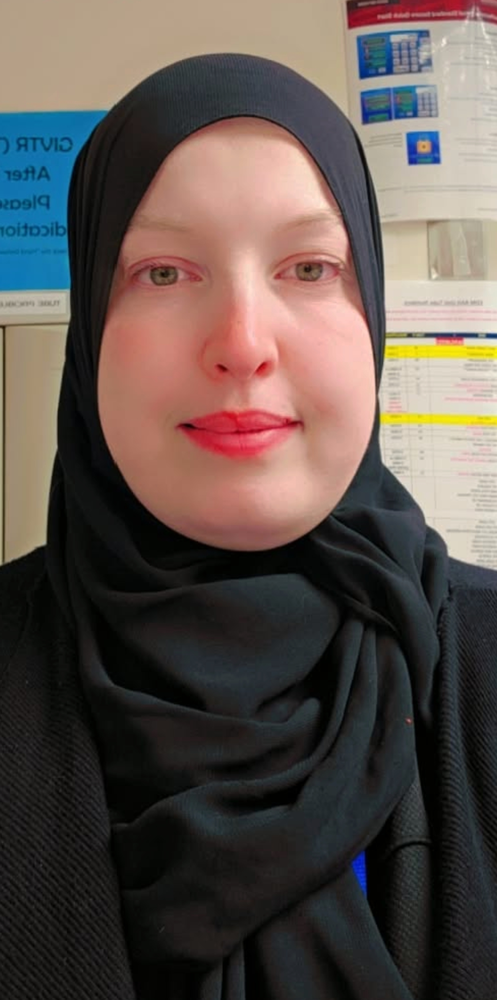

{width=250px}

I have a background in biological sciences and biomedical research. Before joining the MDS program at UBC, I worked in research and developed a strong interest in working with scientific data. I chose data science because I want to build stronger skills in programming, statistics, and data analysis. In the future, I hope to combine my life sciences background with data science in healthcare or biomedical research.

